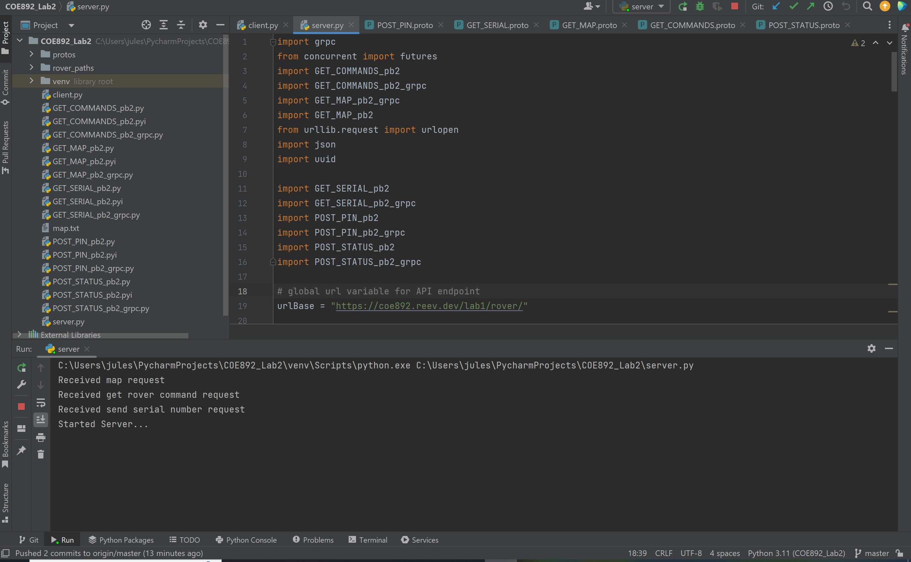
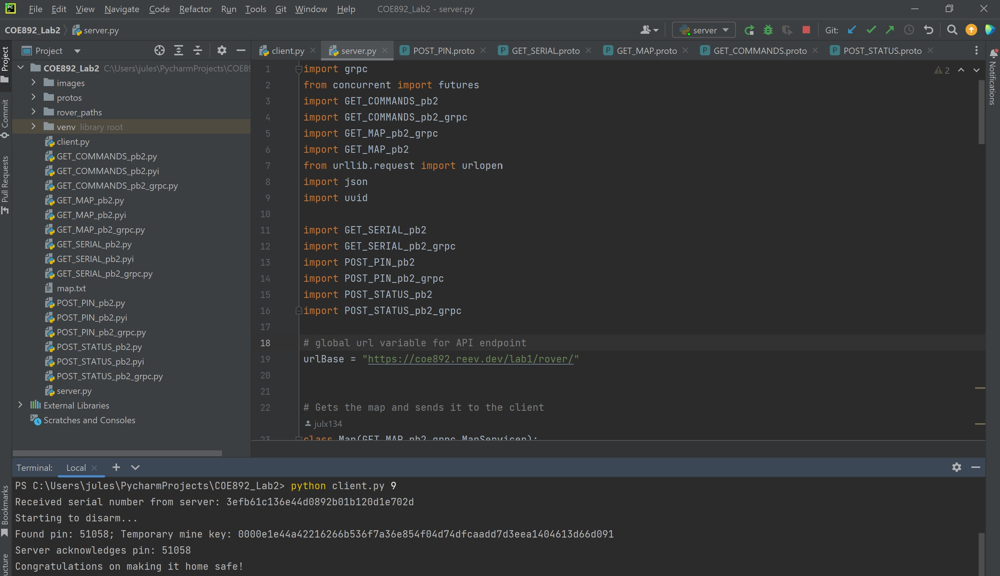
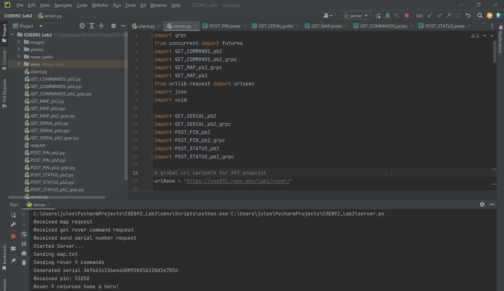

# Python_gRPC

gRPC is an open-source Remote Procedure Call developed by Google. Essentially, it allows a computer to access a subroutine from a computer in
a seperate network. This is done through stubs which marshalls and de-marshalls messages across computer networks. RPC provides a simple and convenient way to build distributed applications by abstracting
away the details of network communication and allowing developers to focus on the logic of their application.

## Set-up/Instructions
1. On the project directory, run the server.py file
2. Then, on a new terminal on the same directory, run the following command below.
3. The program will automatically end once the rover finishes all its moves or dies from a mine. The server will keep running so all you have to do is keep typing the command above for different rover numbers.
```
python client.py {rover_num} 
```
Where rover_num is the specified rover number from 1-10</br></br>

## Implementation
- The implementation builds from my Lab1. Whenever the command is ran with the specified rover number, the client will send the request to the server and the server will pre-process the map.txt file into a matrix abstraction of type string.
- The client receives this string and processes it back to a traversable format like a list. Afterwards, the client will request the server again for the list of commands for the specified rover. The server then receives this command and queries the API for the commands of the rover, and in a similar fashion, sends the list of moves to the client as type string.
- The client once again receives the moves and processes it into a list. Then, it will use the traversal function implemented in Lab 1 to start executing the commands. 
- Whenever a rover lands on a mine and does not dig on the next move it will die.
- In this case, the client will send a status message to the server stating that the rover died and the server will reply back with an acknowledgement. Program ends from here.
- However, if the rover lands on a mine and digs on the next move, it will request the server for a random serial number. Once the random serial number is sent, the client will find the PIN to disarm the mine. Afterwards, it will send the PIN and the temporary mine hash to the server and then moves to execute its next command.
- If the rover makes it to the end of its commands, it will send a status message to the server stating that it did not die and subsequently receive an acknowledgement back from the server.
- As an added feature, it will also write the path_file to the directory called rover_paths

## Sample Output

<br/><br/><br/>

<br/><br/>


